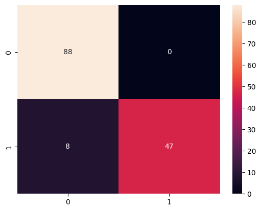

# Project Overview
Classifying the cancer either as Benign on Malignant based using Support Vector Machine. Evaluating the models performance and improving the models accuracy in better predictions.

## Dataset
Data source from - https://archive.ics.uci.edu/dataset/17/breast+cancer+wisconsin+diagnostic
Size of the dataset:
569 rows
32 coloumns

features = [
    'radius', 'texture', 'perimeter', 'area', 'smoothness',
    'compactness', 'concavity', 'concave_points', 'symmetry', 'fractal_dimension'
]

Target =  Diagnosis (M = malignant, B = benign)

## Tools Used 
1. Python, 
2. Pandas, 
3. Seaborn, 
4. Scikit-learn, 
5. Matplotlib

## ALgorithm Used for Classification

Support Vector Machine

# Results 

## Results before improving

## Results after sclaing the training set

## Results after further improvement using C and gamma values

